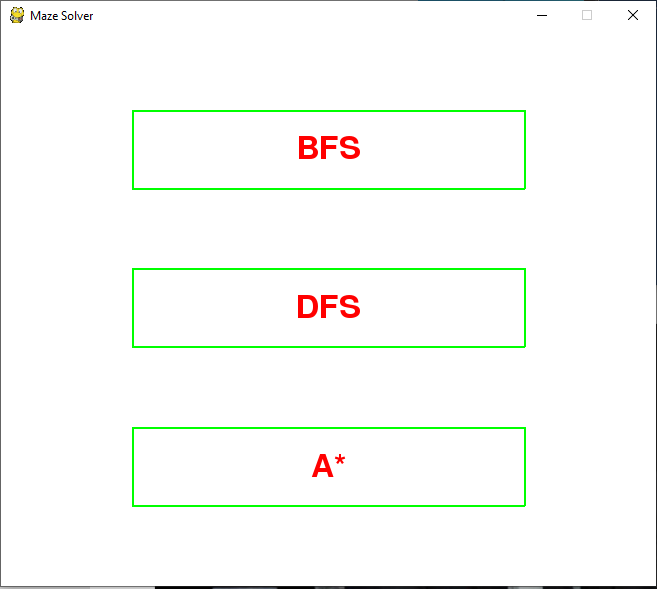
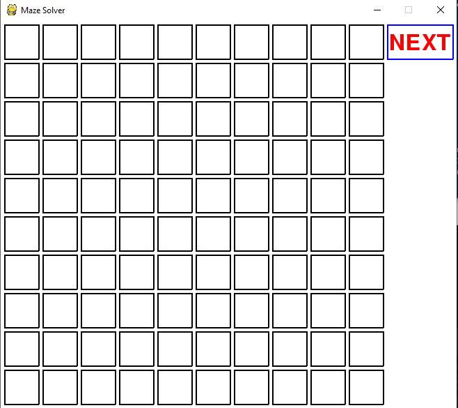
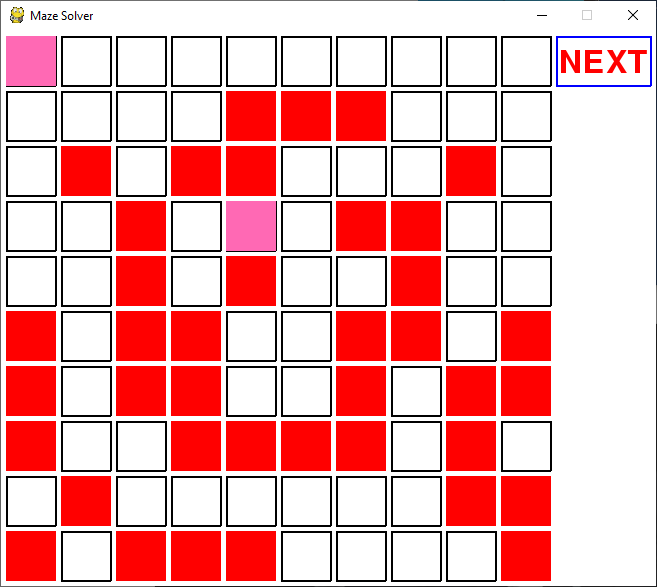
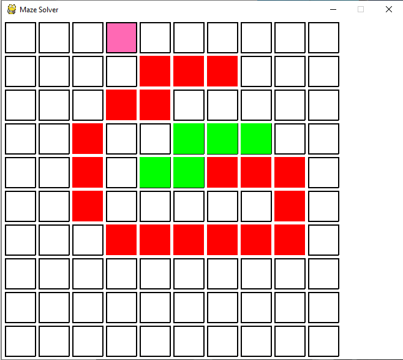
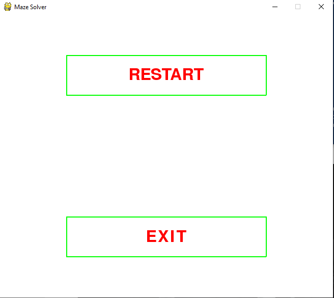

# Maze-Solver
A python project which helps visualize various path finding algorithms like BFS, DFS, and A* written using the pygame library. The user interface (UI) has been developed using pygame and the rest of the code is written in Python. Currently, the program supports BFS and DFS, and the code for A* is going to be uploaded soon.   

### Package Structure:


### Maze-Solver in Action:






### A Brief Overview of the Packages:
- **User Interface:** A package coded primarily in pygame with functions that provide UI/UX elements like the start page, obstacle placing tool, path finding visualization, and the end page among other things.
- **mazeSolver.py:** A file comprising of native Python code with classes such as BFS, DFS, and A* along with other helper functions. The code contained here is the very heart of the project.
- **run.py:** A file which imports code from the aforementioned packages and is responsible for the connecting all the bits and pieces of the project together. 

### Running Maze-Solver on your Desktop:
```
> git clone "https://github.com/nisarg42/Maze-Solver"
> Open the terminal/cmd within cloned directory
> Enter the command: python run.py
```

### Populating Obstacles in the Maze-Solver Grid:
```
> Mouse Left Click: Enter obstacle at location.
> Mouse Right Click: Remove obstacle from location.
> Mouse Center Click: Enter source/destination at location.
```

### Libraries Used by Maze-Solver:
**External Libraries:**
```
> pygame == 1.9.6
```
**In-built Libraries:**
```
> import sys
> import time
```
